# E-commerce Product Analytics

Проект по продуктовой аналитике интернет-магазина: анализ пользовательского поведения, продуктовой воронки, активности, retention, монетизации, повторных покупок и результатов A/B-теста.

Проект выполнен на синтетическом датасете и демонстрирует полный аналитический цикл: **PostgreSQL → SQL → Python → Power BI → продуктовые выводы и гипотезы**.

---

## Dashboard

Интерактивный дашборд построен в **Power BI** и состоит из двух страниц.

### Product Overview

Основные продуктовые и бизнес-метрики: выручка, заказы, AOV, ARPPU, повторные покупки, динамика продаж, категории, конверсия и A/B-тест.

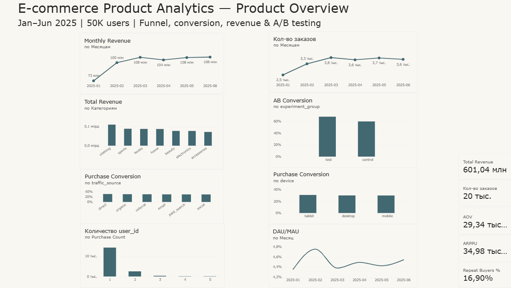

### User Behavior & Retention

Анализ пользовательской активности, когортного retention, количества покупок и времени до второй покупки.

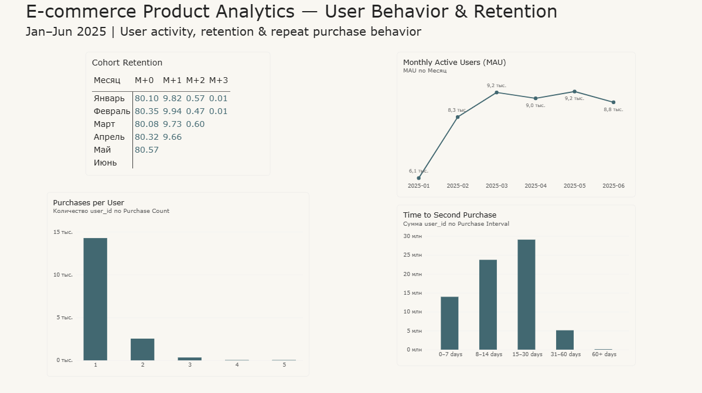

[Power BI файл](dashboard/ecommerce_product_analytics.pbix)

---

## Цели анализа

В рамках проекта исследованы:

* продуктовая воронка от визита до покупки;
* конверсия между этапами воронки;
* DAU, WAU и MAU;
* DAU/MAU (stickiness);
* когортный анализ и retention;
* выручка и динамика продаж;
* AOV и ARPPU;
* количество покупок на пользователя;
* повторные покупки;
* время до второй покупки;
* конверсия по устройствам;
* конверсия по источникам трафика;
* A/B-тест изменения конверсии View Product → Add to Cart.

---

## Стек

* **PostgreSQL**
* **SQL**
* **Python**
* **Pandas**
* **NumPy**
* **Matplotlib**
* **SQLAlchemy**
* **Power BI**
* **Git / GitHub**

---

## Данные

Для проекта был создан синтетический датасет интернет-магазина.

| Показатель   |           Значение |
| ------------ | -----------------: |
| Пользователи |             50 000 |
| Товары       |                500 |
| События      |            209 105 |
| Заказы       |             20 482 |
| Период       | Январь — июнь 2025 |

Основные таблицы PostgreSQL:

* `users`
* `products`
* `events`
* `orders`

Пользовательские события:

* `visit`
* `view_product`
* `add_to_cart`
* `checkout`
* `purchase`

Для A/B-теста пользователи были разделены на группы:

* `control`
* `test`

---

# Основные результаты

## 1. Продуктовая воронка

Последовательная воронка:

**Visit → Product View → Add to Cart → Checkout → Purchase**

| Этап         | Пользователи |
| ------------ | -----------: |
| Visit        |       39 461 |
| Product View |       36 109 |
| Add to Cart  |       27 041 |
| Checkout     |       20 591 |
| Purchase     |       17 181 |

Общая конверсия от визита до покупки составила **43,54%**.

Конверсия между этапами:

* Visit → Product View — **91,51%**
* Product View → Add to Cart — **74,89%**
* Add to Cart → Checkout — **76,15%**
* Checkout → Purchase — **83,44%**

Наибольшее снижение в абсолютном количестве пользователей происходит на переходе **Product View → Add to Cart**, что делает этот этап одним из потенциальных направлений для дальнейшего исследования.

---

## 2. Пользовательская активность

За период анализа:

* средний DAU — около **378 пользователей**;
* максимальный DAU — **467 пользователей**;
* MAU вырос с **6 111 пользователей в январе** до **9 161 в марте**;
* после марта MAU находился примерно в диапазоне **8,8–9,2 тыс. пользователей**;
* DAU/MAU находился примерно в диапазоне **4,35–4,75%**.

---

## 3. Retention

Для когортного анализа использовалась помесячная когорта регистрации.

Для полностью наблюдаемой январской когорты:

| Период | Retention |
| ------ | --------: |
| M+0    |    80,10% |
| M+1    |     9,82% |
| M+2    |     0,57% |
| M+3    |     0,01% |

Для последних когорт поздние периоды наблюдения отсутствуют, поэтому они не сравнивались напрямую с полностью наблюдаемыми когортами.

---

## 4. Монетизация

За весь период:

| Метрика      |       Значение |
| ------------ | -------------: |
| Revenue      | **601,04 млн** |
| Orders       |     **20 482** |
| AOV          |  **29 344,98** |
| Paying Users |     **17 181** |
| ARPPU        |  **34 983,05** |

---

## 5. Выручка по категориям

| Категория   | Доля выручки |
| ----------- | -----------: |
| Clothing    |       18,36% |
| Sports      |       14,77% |
| Books       |       14,63% |
| Home        |       14,54% |
| Beauty      |       12,88% |
| Electronics |       12,84% |
| Accessories |       11,97% |

Выручка распределена между категориями относительно равномерно: ни одна категория не формирует подавляющую часть оборота.

---

## 6. Повторные покупки

За период анализа:

* **2 903** пользователя совершили минимум две покупки;
* доля повторных покупателей среди платящих пользователей — **16,90%**;
* среднее время до второй покупки — **15,35 дня**;
* медианное время — **14,08 дня**.

Распределение времени до второй покупки:

| Интервал   |   Доля |
| ---------- | -----: |
| 0–7 дней   | 18,05% |
| 8–14 дней  | 31,38% |
| 15–30 дней | 43,16% |
| 31–60 дней |  7,30% |
| 60+ дней   |  0,10% |

Таким образом, **92,59% повторных покупателей совершают вторую покупку в течение первых 30 дней**.

Это может быть полезной точкой для дальнейшего исследования retention и механик повторной покупки.

---

## 7. Конверсия по устройствам

Конверсия от сессии до покупки:

| Устройство | Конверсия |
| ---------- | --------: |
| Desktop    |    30,02% |
| Mobile     |    29,95% |
| Tablet     |    30,86% |

В рамках текущего датасета значительных различий между устройствами не наблюдается.

---

## 8. Конверсия по источникам трафика

| Источник    | Конверсия |
| ----------- | --------: |
| Direct      |    31,00% |
| Organic     |    30,35% |
| Referral    |    30,08% |
| Email       |    29,72% |
| Paid Search |    29,56% |
| Social      |    29,45% |

Разница между источниками относительно небольшая. Для более глубокого анализа можно дополнительно учитывать стоимость привлечения и дальнейшую ценность пользователей.

---

# A/B-тест

В проекте проведён A/B-тест изменения пользовательского сценария на этапе:

**View Product → Add to Cart**

Единица анализа — **сессия**.

| Группа  | Просмотрели товар | Добавили в корзину | Конверсия |
| ------- | ----------------: | -----------------: | --------: |
| Control |            29 137 |             17 436 |    59,84% |
| Test    |            28 743 |             19 520 |    67,91% |

Относительное увеличение конверсии в тестовой группе составило:

**+13,49%**

Абсолютная разница между конверсиями:

**+8,07 п.п.**

Для статистической проверки был рассчитан z-score:

**z = 20,21**

Полученный результат указывает на статистически различимую конверсию между группами в рамках данного синтетического эксперимента. Результат рассматривается как основание для дальнейшего анализа механики изменения и повторной проверки на реальных данных.

---

# Продуктовые гипотезы и направления дальнейшего анализа

На основе проведённого анализа можно исследовать:

1. причины потерь пользователей между просмотром товара и добавлением в корзину;
2. влияние цены и категории товара на вероятность добавления в корзину;
3. различия поведения новых и возвращающихся пользователей;
4. причины низкой доли повторных покупателей;
5. факторы, влияющие на вероятность второй покупки;
6. поведение пользователей с высокой суммарной выручкой;
7. влияние источника привлечения на долгосрочную ценность пользователя;
8. повторное проведение A/B-тестов для проверки продуктовых гипотез.

---

# Визуализации

### Product Funnel

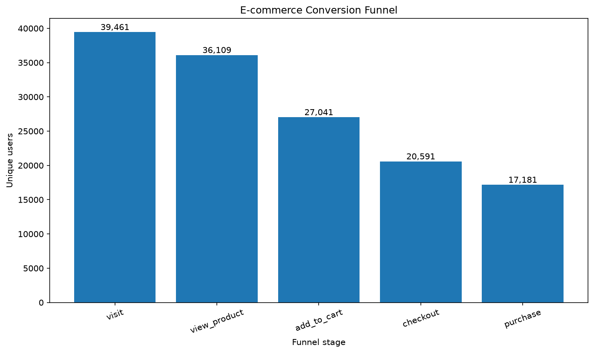

### Funnel Step Conversion

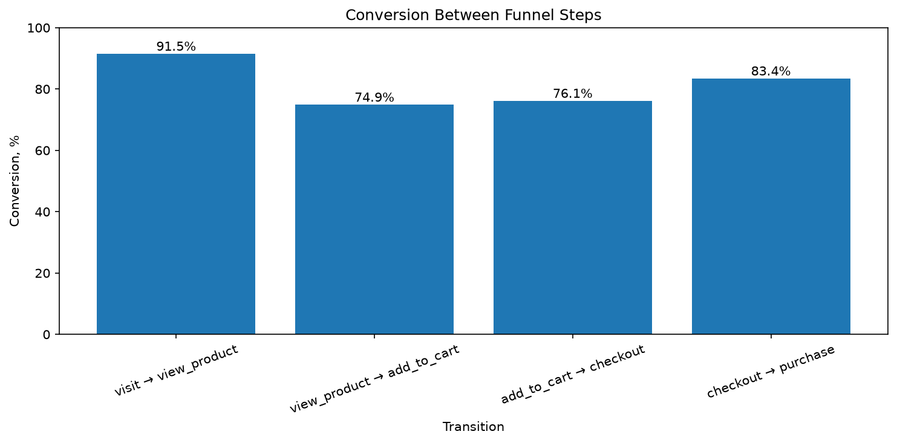

### DAU

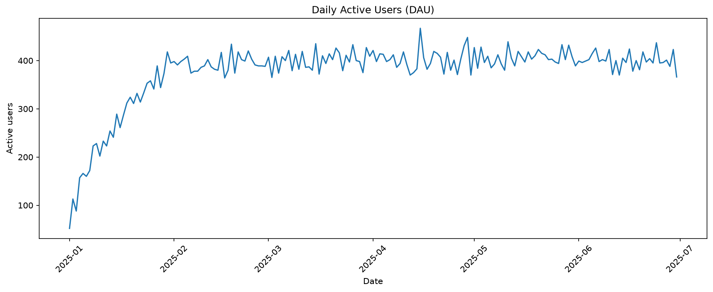

### MAU

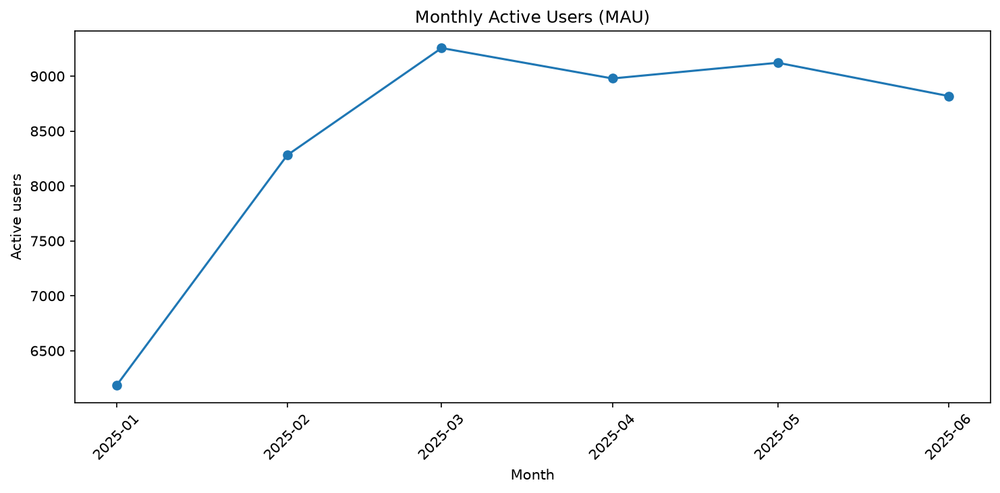

### DAU / MAU

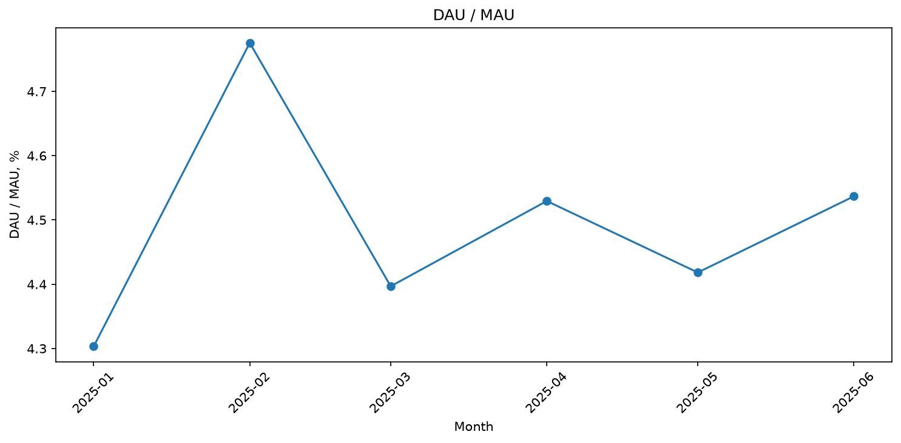

### Cohort Retention

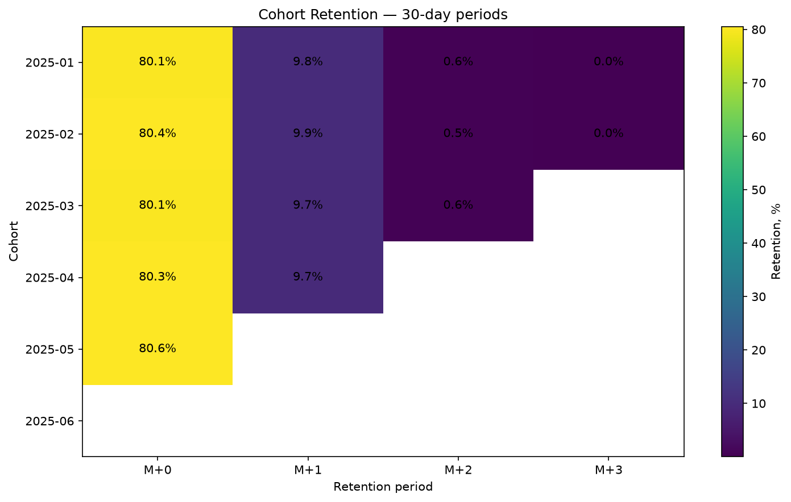

### Monthly Revenue

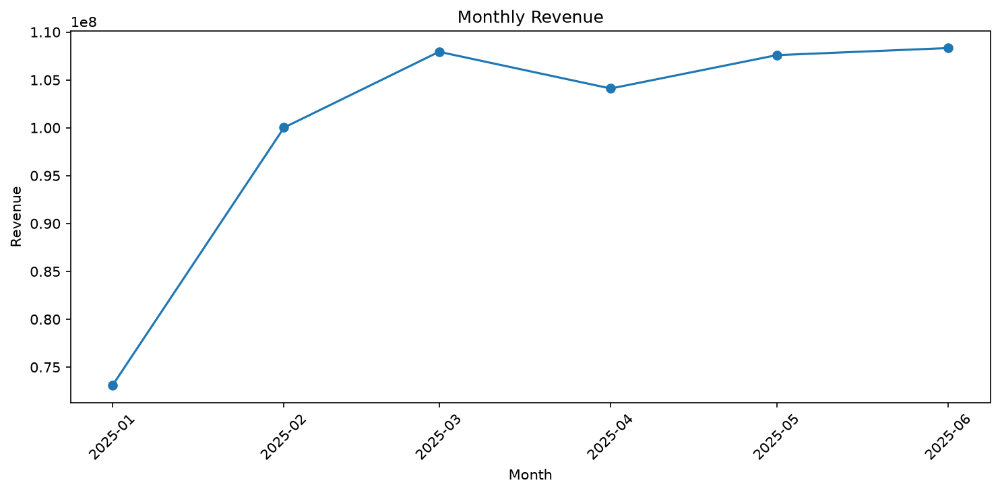

### Revenue by Category

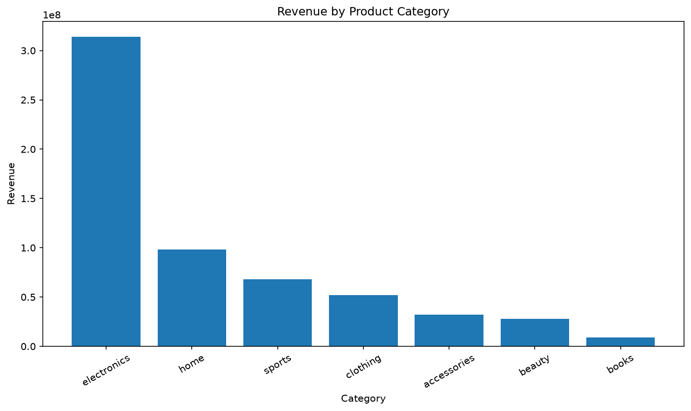

### Purchases per User

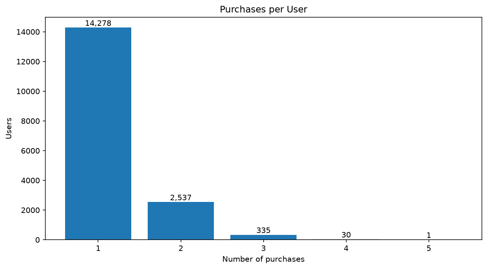

### Time to Second Purchase

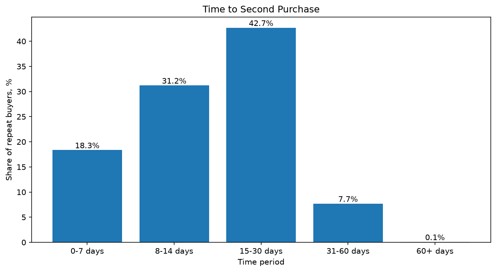

### Conversion by Traffic Source

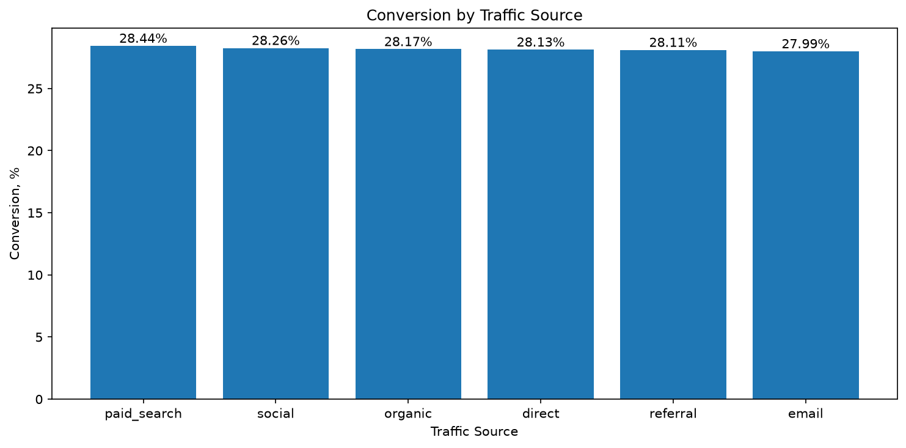

### A/B Test Conversion

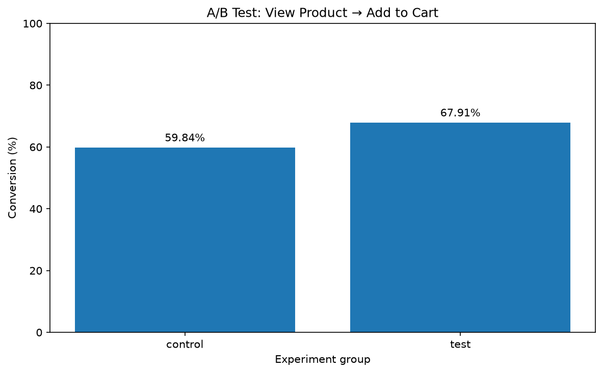

---

# Структура проекта

```text
ecommerce-product-analytics/
│
├── data/
│   └── README.md
│
├── sql/
│   ├── 01_funnel.sql
│   ├── 02_user_activity.sql
│   ├── 03_retention.sql
│   ├── 04_revenue.sql
│   ├── 05_segmentation.sql
│   └── 06_ab_test.sql
│
├── python/
│   ├── generate_data.py
│   └── analysis.py
│
├── dashboard/
│   ├── ecommerce_product_analytics.pbix
│   ├── product_overview.png
│   └── user_behavior_retention.png
│
├── report/
│   ├── analysis.md
│   └── *.png
│
└── README.md
```

---

# Что демонстрирует проект

Проект демонстрирует практическую работу с продуктовой аналитикой:

* PostgreSQL и SQL;
* построение продуктовой воронки;
* анализ конверсии;
* DAU / WAU / MAU;
* DAU/MAU и анализ активности;
* когортный анализ и retention;
* анализ выручки;
* AOV и ARPPU;
* анализ повторных покупок;
* сегментацию пользователей;
* A/B-тестирование;
* статистическую проверку результатов эксперимента;
* Python и Pandas для анализа данных;
* визуализацию результатов;
* Power BI для построения аналитического дашборда;
* формирование продуктовых гипотез на основе данных;
* работу с Git и GitHub.
